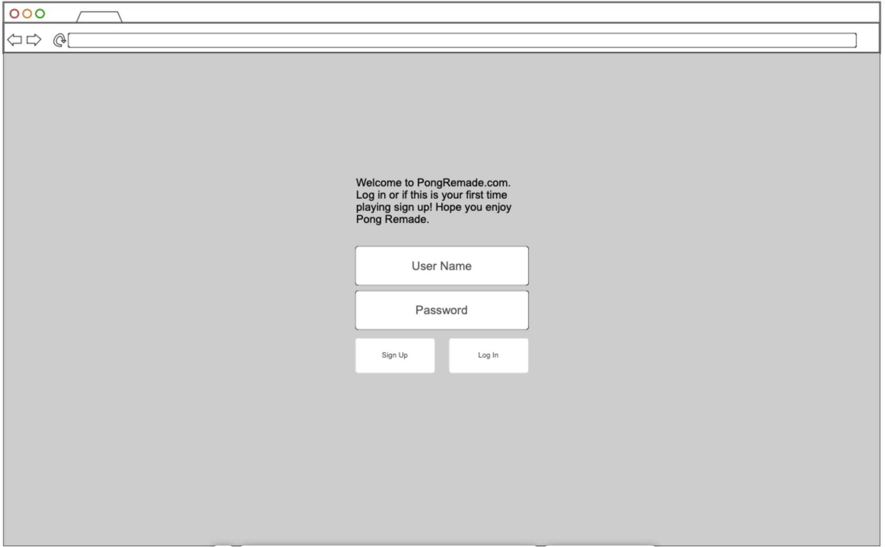
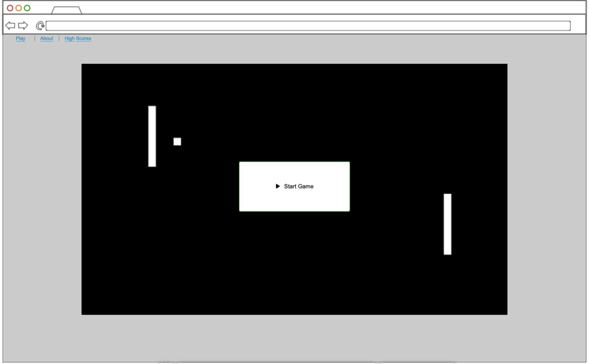
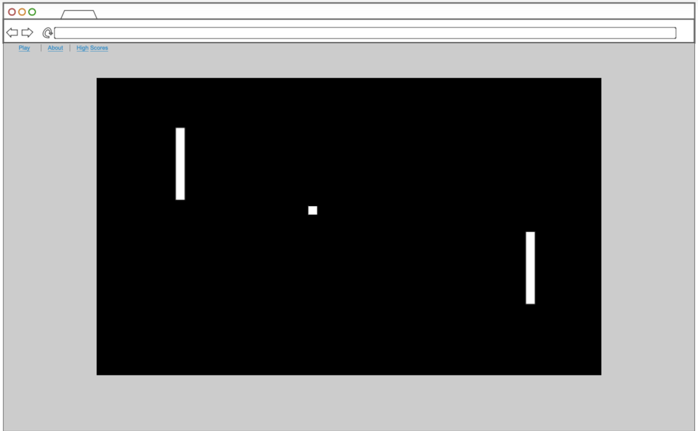
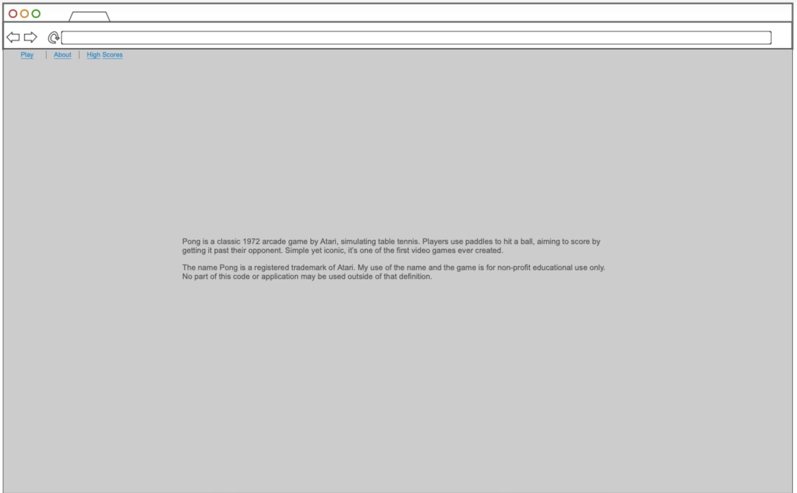
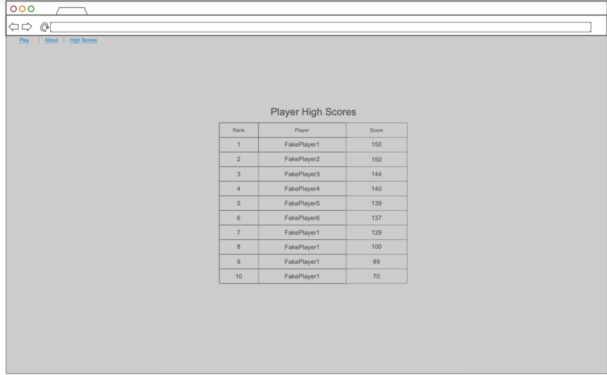

# Pong Remade
CS260 website startup

## Specification Deliverable

### Elevator Pitch

Relive the classic charm of Pong with a modern twist! Our web-based remake offers the timeless gameplay you love, with responsive controls and sleek, minimalist design. Compete for the top spot on the global leaderboard, showcasing high scores from players around the world. No downloads or AI opponents—just pure skill, endless fun, and the chance to prove you’re the best. Simple, addictive, and ready to play in your browser!

### Design

Login:

Start Button:

Game Play:

About:

Leader Board:

### Key Features

- Secure login over HTTPS
- Ability to store high scores and display them
- Ability to take mouse input and move pong board
- Ability for CPU to see the ball and hit it back

### Technologies

I am going to use the required technologies in the following ways:

- **HTML** - Uses correct HTML structure for application. 4 HTML pages. One for login, one for game play, one for about page, one for high scores.
- **CSS** - Application styling that looks good on different screen sizes, uses good whitespace, color choice and contrast.
- **React** - Provides login and game play interaction from user.
- **Service** - Backend service with endpoints for:
  - login
- **DB/Login** - stores users and scores.
- **WebSocket** - High scores are broadcast to all other users.
