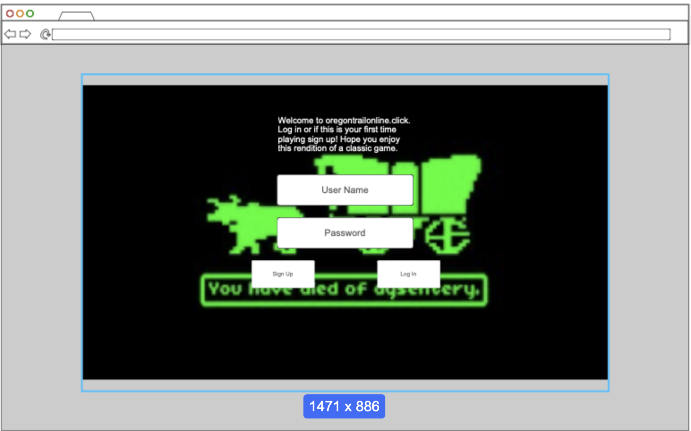
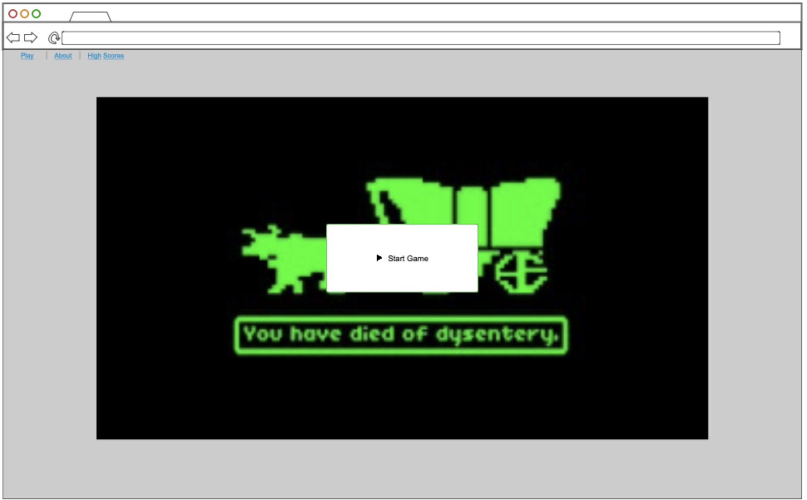
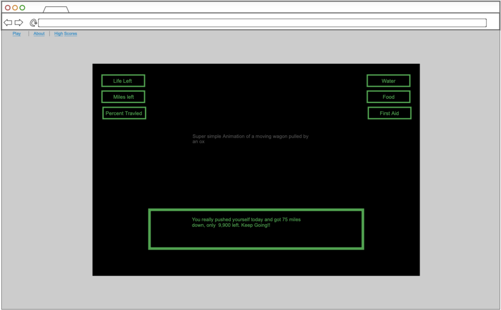
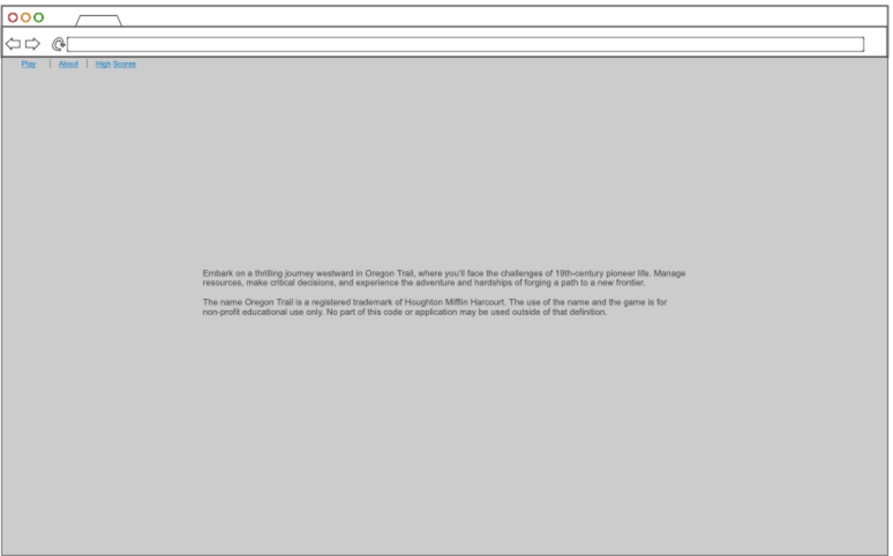
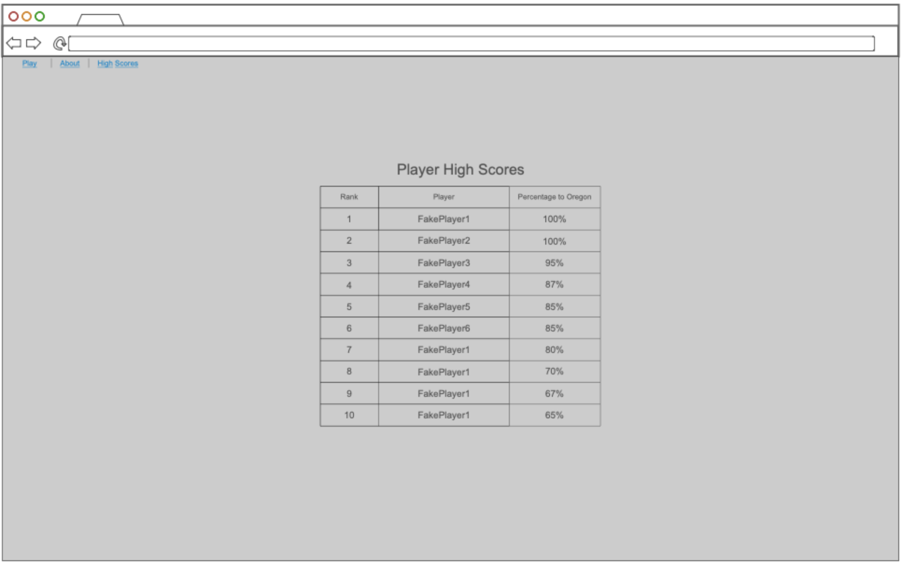

# Oregon Trail Online
CS260 website startup

## Specification Deliverable

### Elevator Pitch

Experience the classic adventure of Oregon Trail reimagined for the web, combining nostalgic gameplay with modern enhancements. Challenge your skills as you lead your wagon party through treacherous terrain, resource shortages, and unexpected events, all while competing with players worldwide. With an integrated leaderboard, you can track your progress and see how you stack up against others in your quest to conquer the frontier. It's a fresh take on a timeless journey—strategic, educational, and endlessly replayable!

### Design

Login:

Start Button:

Game Play:

About:

Leader Board:

### Key Features

- Secure login over HTTPS
- Ability to store high scores and display them
- Simple animation

### Technologies

I am going to use the required technologies in the following ways:

- **HTML** - Uses correct HTML structure for application. 4 HTML pages. One for login, one for game play, one for about page, one for high scores.
- **CSS** - Application styling that looks good on different screen sizes, uses good whitespace, color choice and contrast.
- **React** - Provides login and game play interaction from user.
- **Service** - Backend service with endpoints for:
  - login
- **DB/Login** - stores users and scores.
- **WebSocket** - High scores are broadcast to all other users.

###HTML Deliverable

For this deliverable I added:

- **HTML Pages** 5 individual html pages. One for each view. "index.html" (Login) --> "start_game.html"
(start button) --> "game_play.html" (the game), "about.html" (about page), "leader_board.html" (high scores).

###CSS Deliverable

For this deliverable I did the following. I checked the box [x] and added a description for things I completed.

[x] Header, footer, and main content body - I did complete this part of the deliverable.
[x] Navigation elements - I did complete this part of the deliverable.
[x] Responsive to window resizing - I did complete this part of the deliverable.
[x] Application elements - I did complete this part of the deliverable.
[x] Application text content - I did complete this part of the deliverable.
[x] Application images - I did complete this part of the deliverable.

###React Pt.1 Deliverabele

for this deliverable I did the following:
[x] created the vite files
[x] created the index.jsx file as well as the app.jsx file
[x] ported all html into react

###React pt.2 Deliverabele

for this deliverable I did the following:
[x] Scores are actually interactive
[x] Login page functioning properly
[x] play game working
[x] web socket simulation

##Services

for this deliverable I did the following
[x] user service, including login,register, and logout
[x] score services